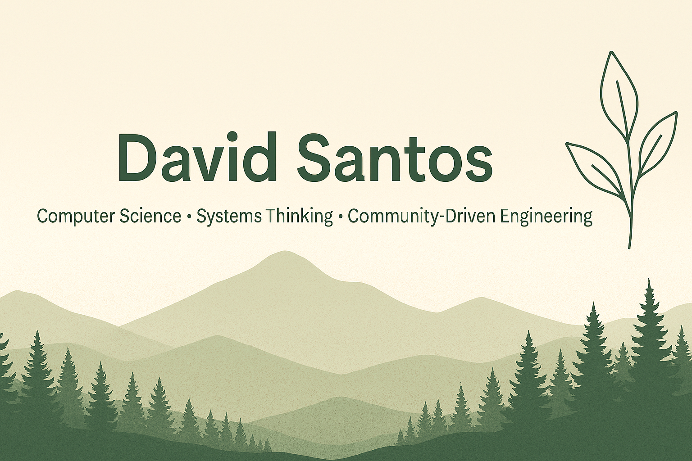

I build technology with the same mindset nature uses to build ecosystems — intentional, scalable, and interconnected. My work blends clean design, data‑driven insight, and a focus on improving the communities around me.

---

## 🌿 What I’m Working On
- **Campus Compass** — a platform designed to help international students better assimilate into the American college experience by providing vital information in a concise, intuitive, and user‑friendly way  
- **Web projects** focused on clarity, accessibility, and human‑centered design  
- **Mentoring peers** in Java, systems, and problem‑solving  
- **Preparing for Summer 2026 internships** in analytics, product, or community‑impact tech  

---

## 🌤️ What I’m Learning
- Data modeling and real‑world analytics  
- Scalable system architecture  
- UI/UX patterns that feel natural and intuitive  
- AI‑driven automation  

---

## 🛠️ Tech Stack
**Languages:** Java, Python, JavaScript, HTML/CSS  
**Libraries:** Scikit‑learn, NumPy, Pandas, Tailwind  
**Tools:** Git, VS Code, Linux, Node.js  
**Focus Areas:** Data pipelines, predictive analytics, UI/UX, community‑focused tech  

---

## 🌲 Featured Projects
### **R2Hintern2025**  
Interactive JavaScript project exploring dynamic web functionality.

### **DavidsTravelRecommender**  
A simple, user‑friendly travel recommendation tool built with JavaScript.

---

## 🌍 About Me
- NSBE chapter leader focused on opportunity, growth, and community  
- Systems thinker who loves breaking down complexity  
- Passionate about accessible, meaningful technology  
- Believer in building tools that help people move through the world more easily  

---

## 🌾 Connect With Me
**LinkedIn:** in/david-aguirre-santos-compsci  
**Location:** United States  

